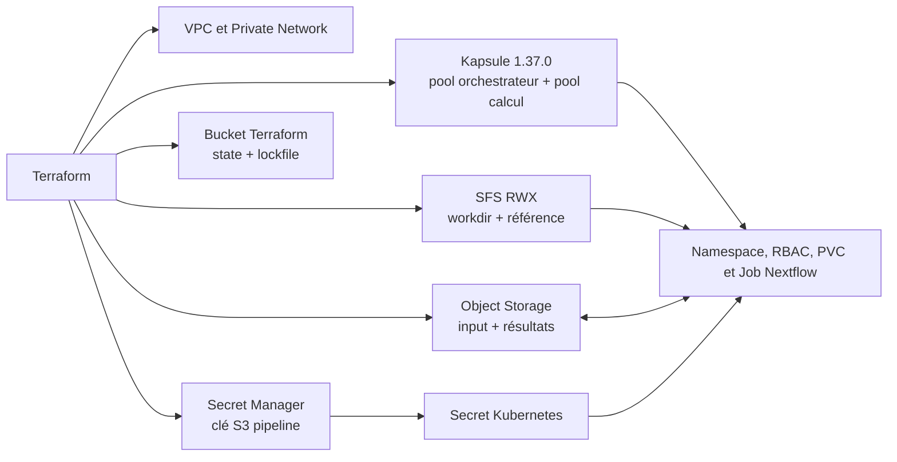
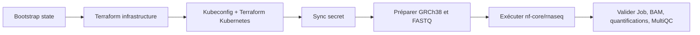

# nf-core/rnaseq sur Scaleway Kapsule

POC Terraform pour Kapsule **1.37.0**, Nextflow **25.10.4** et `nf-core/rnaseq` **3.14.0**. Le projet Scaleway dédié est `hcl-nextflow` (`1d6906b8-42b0-4141-8752-28b7fcfccb95`, organisation SA-Demo), région `fr-par`, zone `fr-par-3`.

Le pipeline utilise `nf-k8s` 1.2.2, `nf-amazon` 3.4.1 et GRCh38 Ensembl 110. Les entrées et résultats vont dans Object Storage; le workdir Nextflow et la référence partagée sont sur SFS RWX.

## Infrastructure



## Workflow



## Prérequis et configuration

Installer Terraform 1.11+, Scaleway CLI `scw`, `kubectl`, AWS CLI v2, `jq`, `curl`, `gzip`, `make` et Bash. Le profil Scaleway doit gérer le projet dédié et lire ses secrets. Un accès S3 backend distinct est requis.

Variables : `SCW_PROFILE` pour Scaleway; `STATE_SECRET_ID`, `STATE_SECRET_REVISION` et `STATE_REGION` pour charger l'identité backend; `STATE_BUCKET` pour les deux states; `RUN_ID` pour chaque run. `STATE_PROJECT_ID` est déjà réglé sur le projet `hcl-nextflow` dans Makefile.

Copier les exemples puis remplacer le bucket `REPLACE_WITH_PRECREATED_STATE_BUCKET` par le même nom dans les deux fichiers backend :

```bash
cp terraform/infra/backend.hcl.example terraform/infra/backend.hcl
cp terraform/kubernetes/backend.hcl.example terraform/kubernetes/backend.hcl
cp terraform/infra/terraform.tfvars.example terraform/infra/terraform.tfvars
cp terraform/kubernetes/terraform.tfvars.example terraform/kubernetes/terraform.tfvars
```

Le bucket Terraform doit être privé et versionné. Il est distinct des buckets input/résultats. La cible `make bootstrap-state` le crée (ou vérifie son versioning); elle passe le `STATE_PROJECT_ID` explicitement au CLI Scaleway.

Charger dans le shell courant la clé backend depuis Secret Manager. Renseigner les trois premières variables avec les identifiants non secrets fournis pour l'environnement. Les valeurs du secret ne s'affichent pas et ne s'écrivent pas dans le dépôt :

```bash
: "${STATE_SECRET_ID:?Set the Secret Manager ID}"
: "${STATE_SECRET_REVISION:?Set the secret revision}"
: "${STATE_REGION:?Set the secret region}"
set +x
state_credentials="$(scw secret version access "$STATE_SECRET_ID" revision="$STATE_SECRET_REVISION" region="$STATE_REGION" raw=true)"
export AWS_ACCESS_KEY_ID="$(jq -er '.access_key' <<<"$state_credentials")"
export AWS_SECRET_ACCESS_KEY="$(jq -er '.secret_key' <<<"$state_credentials")"
unset state_credentials
export STATE_BUCKET="replace-with-unique-state-bucket"
```

Les scripts du pipeline lisent automatiquement leur propre clé S3 depuis Secret Manager. `PIPELINE_S3_ACCESS_KEY` et `PIPELINE_S3_SECRET_KEY` ne sont que des surcharges locales. Ne jamais enregistrer de clé, secret ou kubeconfig dans Git.

Les permissions Object Storage Scaleway sont accordées au niveau projet. Les identités pipeline et backend couvrent les buckets du projet selon leurs permission sets; le projet doit rester dédié à cette solution. La clé backend comprend la suppression nécessaire au verrou Terraform `.tflock`.

## Déployer et valider

`deploy-and-validate` déploie l'infrastructure puis Kubernetes, synchronise le secret, prépare la référence et un petit jeu RNA-seq humain, lance le pipeline et contrôle les artefacts :

```bash
make deploy-and-validate STATE_BUCKET="$STATE_BUCKET" RUN_ID=validation-20260925
```

Terraform demande confirmation. Après revue des plans, `AUTO_APPROVE=1` permet une exécution non interactive. Pour un cluster existant :

```bash
make smoke-test RUN_ID=validation-20260925
make validate-run RUN_ID=validation-20260925
make status
```

Avant de détruire, sauvegarder les données S3/SFS à conserver et arrêter les jobs actifs. `make destroy` est interactif; le bucket de state est conservé :

```bash
make destroy
```

Le run utilise une entrée SRR1039508 réduite à 50 000 paires. La validation vérifie la fin du Job, les logs STAR, le BAM, les quantifications et le rapport MultiQC. Elle confirme le fonctionnement technique, pas la validité biologique des résultats. Reprendre explicitement un run avec `RESUME=1` après vérification du workdir :

```bash
make smoke-test RUN_ID=validation-20260925 RESUME=1
```

## POC et production

Le POC vérifie un petit run humain. La validation e2e du projet doit être confirmée par l'exécution effective et les contrôles ci-dessus. Les pools et PVC par défaut sont petits; les volumes de 300–400 échantillons ou 2,2 To, la reprise après panne, le débit SFS, les coûts et la restauration ne sont pas qualifiés.

Avant toute production, faire un benchmark représentatif STAR, dimensionner SFS/autoscaling, tester reprise et restauration, définir rétention/observabilité, et faire valider les métriques QC. Les permissions IAM objet sont à l'échelle du projet : séparer aussi le backend Terraform dans un projet isolé ou protéger explicitement les autres buckets.

Les instances GEN3 MEMORY offrent une option de benchmark scratch NVMe local; elle n'est pas activée ici. Voir [Préparation production](docs/PRODUCTION-READINESS.md). Les opérations de reprise et destruction sont dans [Exploitation](docs/OPERATIONS.md).
