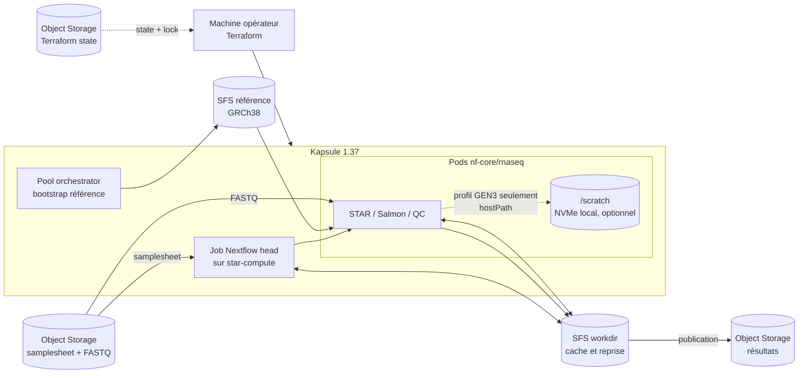

# RNA-seq sur Scaleway Kapsule

Ce dépôt déploie Kapsule **1.37.0**, Nextflow **25.10.4** et nf-core/rnaseq **3.14.0**. Les pools de calcul se mettent à l'échelle à la demande. Le test intégré utilise GRCh38 Ensembl 110 et 50 000 paires de reads.

## Architecture



Le workdir partagé conserve les tâches terminées et permet la reprise avec le même RUN_ID. Le scratch est local au nœud, éphémère et utilisé seulement avec le profil GEN3. Les trois pools portent le tag scw-create-scratch-volume; seuls les nœuds compatibles créés avec ce tag reçoivent le volume.

## Avant de commencer

Sur macOS avec Homebrew :

```bash
brew install scw kubectl awscli jq make curl gzip
brew tap hashicorp/tap
brew install hashicorp/tap/terraform
scw login
```

Terraform 1.11 ou plus récent est requis. Il faut aussi une API key Scaleway autorisée à gérer le projet (réseau, Kapsule, SFS, Object Storage, Secret Manager) et les ressources IAM de l'application Nextflow. En pratique, demandez les permission sets **AllProductsFullAccess** sur le projet dédié et **IAMApplicationManager** (ou **IAMManager**) pour créer l'application, sa clé et sa politique. Voir la [documentation IAM Scaleway](https://www.scaleway.com/en/docs/iam/credentials/create-api-keys/). L'opérateur doit pouvoir lire le secret de pipeline. Pour le premier déploiement, préparez un bucket S3 privé et versionné pour l'état Terraform, ainsi que ses identifiants S3 (AWS_ACCESS_KEY_ID et AWS_SECRET_ACCESS_KEY). Le bucket d'état est distinct des buckets de données.

Dans la console Scaleway, vérifiez les [quotas de l'organisation](https://www.scaleway.com/en/docs/organizations-and-projects/organization/organization-quotas/) et les disponibilités en fr-par-3 (et fr-par-2 pour le pool GEN3) : nœuds des types configurés, CPU/RAM, Kapsule, volumes SFS de 200 et 50 Go, buckets Object Storage et objets IAM/Secrets. Les quotas varient selon l'organisation; demandez leur augmentation avant le déploiement si nécessaire. Renseignez l'UUID de l'opérateur dans operator_user_id.

## Configuration et déploiement

Copiez les exemples de configuration :

```bash
cp terraform/infra/backend.hcl.example terraform/infra/backend.hcl
cp terraform/kubernetes/backend.hcl.example terraform/kubernetes/backend.hcl
cp terraform/infra/terraform.tfvars.example terraform/infra/terraform.tfvars
cp terraform/kubernetes/terraform.tfvars.example terraform/kubernetes/terraform.tfvars
```

Dans les deux backend.hcl, mettez le nom du même bucket d'état. Dans terraform/infra/terraform.tfvars, indiquez le Project UUID cible et l'UUID utilisateur operator_user_id. Ajustez les types et tailles dans ce fichier si besoin. Ne commitez ni ces fichiers générés, ni vos clés.

Créez le bucket d'état avant le premier plan. Les identifiants S3 de ce bucket doivent être actifs dans le shell sous AWS_ACCESS_KEY_ID et AWS_SECRET_ACCESS_KEY :

```bash
make bootstrap-state STATE_BUCKET=mon-bucket-etat STATE_PROJECT_ID=project-uuid
```

Le premier plan vérifie l'infrastructure Scaleway. Examinez-le puis déployez :

```bash
make plan
make deploy STATE_BUCKET=mon-bucket-etat STATE_PROJECT_ID=project-uuid
```

Le déploiement crée les buckets, le réseau, Kapsule, les pools, SFS, l'identité de pipeline, le namespace, les PVC et le secret Kubernetes. Terraform demande confirmation. Pour automatiser après revue du plan : make deploy STATE_BUCKET=mon-bucket-etat STATE_PROJECT_ID=project-uuid AUTO_APPROVE=1.

## Lancer un run synthétique, puis vos données

Le dépôt ne génère pas de FASTQ. Utilisez un jeu synthétique fourni par votre équipe ou votre outil de simulation, puis répétez les étapes avec les échantillons réels. Chaque run a son propre identifiant et son propre préfixe S3.

Préparez une samplesheet nf-core/rnaseq et déposez-la avec les FASTQ dans le bucket d'entrée, sous validation/<run-id>/. Le CSV doit référencer les FASTQ par URI s3:// :

```csv
sample,fastq_1,fastq_2,strandedness
patient_001,s3://BUCKET/validation/synthetic-001/patient_001_R1.fastq.gz,s3://BUCKET/validation/synthetic-001/patient_001_R2.fastq.gz,unstranded
```

Récupérez le nom du bucket avec make outputs. Pour utiliser AWS CLI, chargez la clé de l'application depuis Secret Manager :

```bash
SECRET_ID=$(terraform -chdir=terraform/infra output -raw pipeline_credentials_secret_id)
SECRET_REVISION=$(terraform -chdir=terraform/infra output -raw pipeline_credentials_revision)
SECRET=$(scw secret version access "$SECRET_ID" revision="$SECRET_REVISION" region=fr-par raw=true)
export AWS_ACCESS_KEY_ID=$(jq -er '.access_key' <<<"$SECRET")
export AWS_SECRET_ACCESS_KEY=$(jq -er '.secret_key' <<<"$SECRET")
export AWS_DEFAULT_REGION=fr-par
unset SECRET
```

Déposez les FASTQ et le CSV avec l'endpoint https://s3.fr-par.scw.cloud. La policy de l'application autorise l'écriture sous validation/. Exemple, après avoir remplacé BUCKET par le résultat de make outputs :

```bash
aws --endpoint-url https://s3.fr-par.scw.cloud s3 cp patient_001_R1.fastq.gz s3://BUCKET/validation/synthetic-001/
aws --endpoint-url https://s3.fr-par.scw.cloud s3 cp patient_001_R2.fastq.gz s3://BUCKET/validation/synthetic-001/
aws --endpoint-url https://s3.fr-par.scw.cloud s3 cp samplesheet.csv s3://BUCKET/validation/synthetic-001/
```

Vous pouvez aussi utiliser la console Object Storage. Lancez ensuite :

```bash
make run RUN_ID=synthetic-001 INPUT=s3://BUCKET/validation/synthetic-001/samplesheet.csv
```

make run vérifie la référence GRCh38 sur SFS (et l'installe si nécessaire), puis attend la fin du pipeline. La commande échoue si Nextflow retourne une erreur. Contrôlez le rapport MultiQC et les fichiers de sortie, puis lancez les données réelles avec une nouvelle samplesheet :

```bash
make run RUN_ID=real-001 INPUT=s3://BUCKET/validation/real-001/samplesheet.csv
```

Les ressources par processus se règlent dans nextflow/nextflow.config; les paramètres, notamment la référence, dans nextflow/params.yaml. Pour reprendre un run échoué, vérifiez ses entrées et son workdir SFS puis gardez le même identifiant :

```bash
make run RUN_ID=synthetic-001 INPUT=s3://BUCKET/validation/synthetic-001/samplesheet.csv RESUME=1
make status
kubectl logs -n bioinformatics -f job/nextflow-synthetic-001
```

Par défaut, les BAM intermédiaires ne sont pas conservés pour limiter stockage et transferts. Pour les garder, ajoutez SAVE_ALIGN_INTERMEDS=true à make run.

Pour tester les pods STAR sur le pool MEMORY3 et son NVMe /scratch, après avoir vérifié le montage du nouveau nœud :

```bash
make run RUN_ID=scratch-001 INPUT=s3://BUCKET/validation/scratch-001/samplesheet.csv GEN3_SCRATCH_BENCHMARK=1
```

## Nettoyage et limites

Avant make destroy, arrêtez les jobs et sauvegardez les données S3/SFS à garder. Le bucket d'état reste en place. destroy demande confirmation.

Le dépôt valide le parcours POC sur un petit jeu; il ne qualifie pas encore le dimensionnement production, une restauration complète ni les seuils biologiques. Les constats et corrections des incidents de reprise sont dans [Exploitation](docs/OPERATIONS.md); mesures et limites de performance dans [Préparation production](docs/PRODUCTION-READINESS.md).
