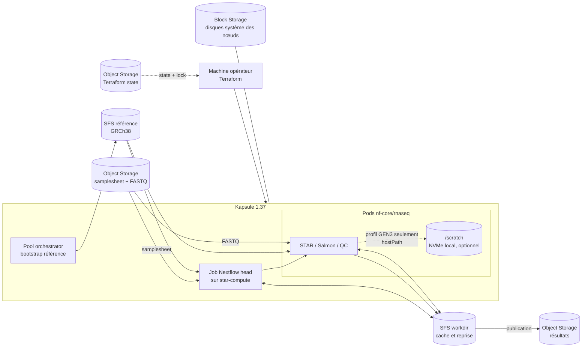

# RNA-seq sur Scaleway Kapsule

Ce dépôt déploie Kapsule **1.37.0**, Nextflow **25.10.4** et nf-core/rnaseq **3.14.0**. Les pools de calcul se mettent à l'échelle à la demande. Le test intégré utilise GRCh38 Ensembl 110 et 50 000 paires de reads.

## Architecture



Le workdir partagé conserve les tâches terminées et permet la reprise avec le même RUN_ID. Le scratch est local au nœud, éphémère et utilisé seulement avec le profil GEN3. Les trois pools portent le tag scw-create-scratch-volume; seuls les nœuds compatibles créés avec ce tag reçoivent le volume.

## Avant de commencer

Sur macOS avec Homebrew :

```bash
brew install scw kubectl awscli jq make curl gzip
brew tap hashicorp/tap
brew install hashicorp/tap/terraform
scw login
```

Terraform 1.11 ou plus récent est requis. Il faut aussi une API key Scaleway autorisée à gérer le projet (réseau, Kapsule, SFS, Object Storage, Secret Manager) et les ressources IAM de l'application Nextflow. Pour ce POC dédié, demandez les permission sets **AllProductsFullAccess** sur le projet et **IAMApplicationManager** (ou **IAMManager**) pour créer l'application, sa clé et sa politique; réduisez ces droits avant la production. Voir la [documentation IAM Scaleway](https://www.scaleway.com/en/docs/iam/credentials/create-api-keys/). L'opérateur doit pouvoir lire le secret de pipeline.

Utilisez le profil local créé par `scw login` pour le déploiement. Si `SCW_SECRET_KEY` est exportée, `scw k8s kubeconfig install` l'inscrit dans le kubeconfig.

Pour le premier déploiement, préparez un bucket S3 privé et versionné pour l'état Terraform, ainsi que ses identifiants S3 (AWS_ACCESS_KEY_ID et AWS_SECRET_ACCESS_KEY). Placez ce bucket dans un **projet Scaleway distinct** du projet Nextflow : l'identité du pipeline possède des droits Object Storage à l'échelle de son projet.

Dans la console Scaleway, vérifiez les [quotas de l'organisation](https://www.scaleway.com/en/docs/organizations-and-projects/organization/organization-quotas/) et les disponibilités en fr-par-3 (et fr-par-2 pour le pool GEN3) : nœuds des types configurés, CPU/RAM, Kapsule, volumes SFS de 200 et 50 Go, buckets Object Storage et objets IAM/Secrets. Les quotas varient selon l'organisation; demandez leur augmentation avant le déploiement si nécessaire. Renseignez l'UUID de l'opérateur dans operator_user_id.

## Configuration et déploiement

Copiez les exemples de configuration :

```bash
cp terraform/infra/backend.hcl.example terraform/infra/backend.hcl
cp terraform/kubernetes/backend.hcl.example terraform/kubernetes/backend.hcl
cp terraform/infra/terraform.tfvars.example terraform/infra/terraform.tfvars
cp terraform/kubernetes/terraform.tfvars.example terraform/kubernetes/terraform.tfvars
```

Dans les deux backend.hcl, mettez le nom du même bucket d'état. Dans terraform/infra/terraform.tfvars, indiquez le Project UUID cible et l'UUID utilisateur operator_user_id. Ajustez les types et tailles dans ce fichier si besoin. Ne commitez ni ces fichiers générés, ni vos clés. L'état Terraform infra contient la clé IAM du pipeline : limitez l'accès au bucket d'état et à ses anciennes versions.

Un administrateur du projet d'état crée **une seule fois** son bucket privé et versionné, dans un projet différent de `scw_project_id` :

```bash
scw object bucket create mon-bucket-etat enable-versioning=true acl=private project-id=UUID_PROJET_ETAT region=fr-par
```

Chaque opérateur charge ses propres identifiants S3 autorisés sur ce bucket avant Terraform :

```bash
export AWS_ACCESS_KEY_ID="CLE_ETAT"
export AWS_SECRET_ACCESS_KEY="SECRET_ETAT"
```

Le premier plan vérifie l'infrastructure Scaleway. Examinez-le puis déployez :

```bash
export KUBECONFIG="$HOME/.kube/config-hcl-public-netflow"
make plan
make deploy
```

Le déploiement crée les buckets, le réseau, Kapsule, les pools, SFS, l'identité de pipeline, le namespace, les PVC et le secret Kubernetes. Terraform affiche et demande confirmation pour chacun des deux plans, infrastructure puis Kubernetes.

## Lancer un run synthétique, puis vos données

Le dépôt ne génère pas de FASTQ. Utilisez un jeu synthétique fourni par votre équipe ou votre outil de simulation, puis répétez les étapes avec les échantillons réels. Chaque run a son propre identifiant et son propre préfixe S3.

Préparez une samplesheet nf-core/rnaseq et déposez-la avec les FASTQ dans le bucket d'entrée, sous `validation/<run-id>/`. Le CSV doit référencer les FASTQ par URI `s3://` :

```csv
sample,fastq_1,fastq_2,strandedness
patient_001,s3://BUCKET/validation/synthetic-001/patient_001_R1.fastq.gz,s3://BUCKET/validation/synthetic-001/patient_001_R2.fastq.gz,unstranded
```

Récupérez le nom du bucket avec `make outputs`. Pour les uploads, utilisez les identifiants de l'application dans un sous-shell : les identifiants du state restent ainsi actifs pour les commandes Terraform.

```bash
SECRET_ID=$(terraform -chdir=terraform/infra output -raw pipeline_credentials_secret_id)
SECRET_ID=${SECRET_ID##*/}
SECRET_REVISION=$(terraform -chdir=terraform/infra output -raw pipeline_credentials_revision)
(
set -e
SECRET=$(scw secret version access "$SECRET_ID" revision="$SECRET_REVISION" region=fr-par raw=true)
AWS_ACCESS_KEY_ID=$(jq -er '.access_key' <<<"$SECRET")
AWS_SECRET_ACCESS_KEY=$(jq -er '.secret_key' <<<"$SECRET")
export AWS_ACCESS_KEY_ID AWS_SECRET_ACCESS_KEY AWS_DEFAULT_REGION=fr-par
unset SECRET
aws --endpoint-url https://s3.fr-par.scw.cloud s3 cp patient_001_R1.fastq.gz s3://BUCKET/validation/synthetic-001/
aws --endpoint-url https://s3.fr-par.scw.cloud s3 cp patient_001_R2.fastq.gz s3://BUCKET/validation/synthetic-001/
aws --endpoint-url https://s3.fr-par.scw.cloud s3 cp samplesheet.csv s3://BUCKET/validation/synthetic-001/
)
```

Remplacez `BUCKET` par le nom du bucket d'entrée. La policy de l'application autorise l'écriture sous `validation/`. Vous pouvez aussi utiliser la console Object Storage.

Installez la référence une fois depuis un terminal opérateur. La création du Job ne bloque pas; attendez sa fin avant de lancer le run. Le Job s'exécute sur le pool orchestrator :

```bash
make reference
kubectl wait -n bioinformatics --for=condition=complete job/reference-bootstrap-ensembl-110 --timeout=6h
```

`make reference` applique la configuration de façon idempotente quand elle n'a pas changé. Si une modification de configuration échoue parce que le template du Job est immuable, vérifiez que le Job est `Failed` ou `Complete`, supprimez-le, puis réappliquez. Ne supprimez jamais un Job actif :

```bash
kubectl get job -n bioinformatics reference-bootstrap-ensembl-110
# Seulement si la condition du Job est Failed ou Complete :
kubectl delete job -n bioinformatics reference-bootstrap-ensembl-110
make reference
```

Chaque lancement utilise une configuration locale rendue en ConfigMap propre au run. Copiez le modèle, puis renseignez `RUN_ID`, `INPUT`, `OUTDIR`, `RUN_RESUME=0`, `NF_PROFILE=scaleway_kapsule` et `AWS_DEFAULT_REGION=fr-par` dans `kubernetes/run/run.env` :

```bash
cp kubernetes/run/run.env.example kubernetes/run/run.env
```

`OUTDIR` est le préfixe de sortie S3, par exemple `s3://BUCKET/runs/synthetic-001`. Kustomize génère un ConfigMap suffixé par le hash de la configuration (fichiers et `run.env`); ces ConfigMaps restent présents après le run. Supprimez-les explicitement quand ils ne servent plus, après avoir vérifié qu’aucun Job ne les utilise. `make run` applique le Job sans attendre sa fin :

```bash
make run
kubectl get job -n bioinformatics "nextflow-synthetic-001"
kubectl logs -n bioinformatics -f job/nextflow-synthetic-001
```

Le Job head s'exécute sur `star-compute`; son init container vérifie la référence GRCh38 Ensembl 110 sur SFS avant que Nextflow démarre. Le contrôle de référence compare le manifeste et les tailles en lecture seule, sans relire les fichiers pour calculer leur SHA; il se répète à chaque run; si la référence manque, le Job échoue avant Nextflow. Contrôlez le rapport MultiQC et les sorties. Pour les données réelles, versez une nouvelle samplesheet et les FASTQ dans un préfixe dédié, modifiez les valeurs de `run.env`, puis lancez `make run` à nouveau.

Les ressources par processus se règlent dans `kubernetes/base/nextflow.config`; les paramètres, notamment la référence, dans `kubernetes/base/params.yaml`. Pour reprendre un run échoué, gardez le même `RUN_ID`, vérifiez que le Job est en état terminal (`Failed` ou `Complete`) et contrôlez le workdir SFS. Mettez `RUN_RESUME=1` dans `run.env`, supprimez explicitement l’ancien Job terminal, puis appliquez la configuration. Ne supprimez pas un Job actif : sa suppression interrompt le pipeline. Le nom du Job reste `nextflow-<RUN_ID>` et un Job Kubernetes ne peut pas être modifié en place; le ConfigMap hashé permet de publier la nouvelle configuration de reprise sous un nom distinct.

```bash
kubectl get job -n bioinformatics "nextflow-$RUN_ID"
# Seulement si la condition du Job est Failed ou Complete :
kubectl delete job -n bioinformatics "nextflow-$RUN_ID"
kubectl apply -k kubernetes/run
```

Le runner conserve et utilise l'UUID de session Nextflow du run pour `-resume`; il ne choisit pas une session globale récente. Par défaut, les BAM intermédiaires ne sont pas conservés. Le profil `scaleway_kapsule` est celui du run standard. Pour le test NVMe, réglez `NF_PROFILE=scaleway_kapsule,gen3_scratch_benchmark` dans `run.env`. Ce profil reste un essai opt-in, limité au pool GEN3 `gen3-probe` en `fr-par-2`; les pods STAR gardent leur contrôle par pod du montage `/scratch`. Les pools portent le tag `scw-create-scratch-volume`, qui ne fournit un volume que sur les nouveaux nœuds compatibles.

## Vérification du lancement simplifié — 30 septembre 2026

Les deux plans Terraform avec refresh et verrou S3 ne prévoient aucun changement sur l'infrastructure existante. Les quatre tests locaux, les validations Terraform et la validation des manifests par l'API Kubernetes passent. Le parcours utilise trois scripts applicatifs (272 lignes, contre six et 656 auparavant) : synchronisation du secret, installation/contrôle de la référence, conservation de la session Nextflow. Les Jobs sont déclarés en YAML; `make` est un raccourci pour les commandes natives.

| Heure UTC | Étape | Résultat | Pool |
| --- | --- | --- | --- |
| 08:25:10–08:25:22 | Job référence avec les nouveaux manifests | Référence SFS existante vérifiée, sans téléchargement | orchestrator |
| 08:26:18 | `make run`, puis seconde application identique | Même UID de Job conservé, sans redémarrage | star-compute |
| 08:27:55–08:27:57 | Contrôle référence puis démarrage du head | Init réussi, Nextflow démarré | star-compute |
| 08:41:16 | Création du nœud GEN3 par autoscaling | MEMORY3-X8C-64G disponible | gen3-probe |
| 08:50:57–09:28:16 | Calcul de l'index STAR | 37 min 19 s de calcul sur scratch; tâche complète ~1 h 10 avec staging et attente | gen3-probe |
| 09:51:08–10:16:32 | Chargement de l'index puis alignement STAR | 46 597 / 49 539 paires alignées de façon unique (94,06 %) | gen3-probe |
| 10:16:34–~10:30:05 | Salmon, featureCounts, QC et publication | Quantifications et MultiQC publiés sur S3 | star-compute |
| 10:28:41 | Retrait automatique du nœud GEN3 | Pool de nouveau à zéro | gen3-probe |
| 10:30:14 | Fin du Job | `Complete`, 45 tâches terminées avec code 0 | star-compute |

**Durée : 2 h 03 min 56 s**, contre 3 h 31 min 17 s lors de l'essai POP2/SFS du 29 septembre (~41 % de temps total en moins). La comparaison change à la fois le type de CPU et le stockage temporaire; elle n'isole donc pas le gain du NVMe. La lecture de l'index pour l'alignement reste sur SFS : le chargement dure encore ~22 min 32 s, puis l'alignement final du petit jeu dure 3 s. L'index calculé sur scratch doit aussi revenir sur SFS; le temps de tâche inclut ces transferts.

Le run `smoke-native-20260930` utilise le même échantillon public ENA SRR1039508 décrit ci-dessous : 50 000 paires humaines de 63 bases, deux FASTQ gz totalisant 5 226 949 octets, `unstranded`, référence GRCh38 Ensembl 110. Le profil est `scaleway_kapsule,gen3_scratch_benchmark`. Les deux pods STAR ont confirmé `/scratch=/dev/sdb`, ext4, inscriptible, distinct du système, avec ~145,6 GiB libres. Le contrôle par pod est donc validé sur ce nouveau nœud.

Les sorties S3 ont été contrôlées : **389 objets, 557 258 837 octets**, BAM et index BAM présents, logs STAR, featureCounts, `quant.sf` et rapport HTML MultiQC lisibles. STAR garde 49 539 paires après filtrage; featureCounts affecte 43 428 fragments. Salmon donne **10 036 transcrits non nuls**, contre 10 029 le 29 septembre. Ces résultats valident le parcours technique sur un petit échantillon; l'écart Salmon et les seuils biologiques restent à qualifier. Les avertissements temporaires de scheduling ont été résolus par l'autoscaling et la file d'attente; aucune tâche n'a échoué.

**Coût estimé sur la durée du run : environ 2,7 € HT**, hors arrondis de facturation et postes non chiffrés. Les prix des nœuds ont été vérifiés via l'API Scaleway `instance server-type list` dans chaque zone; la page web affiche par défaut PAR-1.

| Ressource | Tarif HT | Durée retenue | Estimation |
| --- | ---: | ---: | ---: |
| orchestrator POP2-4C-16G, fr-par-3 | 0,2205 €/h | 2 h 03 min 56 s | 0,46 € |
| star-compute POP2-HM-8C-64G, fr-par-3 | 0,618 €/h | 08:26:39–10:30:14 | 1,27 € |
| gen3-probe MEMORY3-X8C-64G, fr-par-2 | 0,4532 €/h | 08:41:16–10:28:41 | 0,81 € |
| SFS référence + workdir, 250 Go | 0,000221 €/Go/h | 2 h 03 min 56 s | 0,11 € |
| Disques système Block 5K, 20 Go par nœud | 0,000130 €/Go/h | Durées des nœuds ci-dessus | ~0,02 € |

Sources : [tarifs Instances Scaleway](https://www.scaleway.com/en/pricing/virtual-instances/) et [stockage Scaleway](https://www.scaleway.com/en/pricing/storage/). Object Storage, IPv4, Secret Manager et une éventuelle tarification du scratch ne sont pas inclus dans cette estimation; les volumes existants et leurs anciennes versions ne sont pas attribués à ce seul run. Les horaires Kubernetes bornent la durée GEN3; le début/fin de facturation peut différer. L'orchestrator, SFS et le nœud star-compute encore présent à la fin restent facturés après 10:30:14 jusqu'à leur éventuel retrait. Ce montant **n'est pas une facture**, ni le coût d'un provisionnement neuf.

Pour reproduire le test, suivez « Refaire le test » ci-dessous et remplacez la ligne de `run.env` par `NF_PROFILE=scaleway_kapsule,gen3_scratch_benchmark`. Fermer le terminal ne suspend pas le Job; `kubectl get job` et `kubectl logs` suffisent pour reprendre le suivi. Seule la ConfigMap propre à ce run a été supprimée après succès; les PVC et résultats sont conservés.

## Essai observé le 29 septembre 2026

Le test `smoke-simplified-20260929` a tourné sur le cluster **déjà créé** du projet `hcl-nextflow`, en `fr-par-3`. `make deploy` a réconcilié Terraform et Kubernetes sans changement d'infrastructure. Ce test ne mesure donc pas le temps d'un déploiement neuf. Lors de la création initiale, le cluster Kapsule est passé de « créé » à « prêt » le 25 septembre entre 13:39:25 et 13:41:47 UTC (2 min 22 s), sans que cela mesure l'installation complète.

Le jeu public [ENA SRR1039508](https://www.ebi.ac.uk/ena/browser/view/SRR1039508) contient ici **un échantillon humain RNA-seq**, réduit à **50 000 paires de lectures de 63 bases** : deux FASTQ compressés de 2 628 433 et 2 598 516 octets (5 226 949 octets au total), `unstranded`. La référence est **GRCh38 Ensembl 110**. Le pipeline a vérifié la référence SFS, généré l'index STAR, contrôlé et filtré les FASTQ, aligné les lectures avec STAR, quantifié avec Salmon et featureCounts, puis produit les contrôles qualité et MultiQC. Le run a utilisé les nœuds **POP2** et SFS; le pool GEN3/NVMe n'a pas participé à cet essai.

| Heure UTC | Étape observée | Résultat | Pool |
| --- | --- | --- | --- |
| 15:52:13–15:52:23 | Vérification de la référence déjà présente | Job terminé | orchestrator |
| 15:52:30 | Démarrage du Job Nextflow | Échantillon pris en charge | star-compute |
| ~16:08–18:46 | Génération de l'index STAR | Index disponible sur SFS | star-compute |
| 18:47:02–19:13:17 | STAR : chargement de l'index puis alignement | 46 597 / 49 539 paires alignées de façon unique (94,06 %) | star-compute |
| ~19:13–19:23 | Salmon, featureCounts, QC et publication | Sorties écrites dans Object Storage | star-compute |
| 19:23:47 | Fin du Job | `Complete`, pipeline réussi | star-compute |

**Durée du run : 3 h 31 min 17 s.** Après filtrage, 49 539 paires sont restées. featureCounts a affecté 43 428 fragments; Salmon a trouvé 10 029 transcrits avec une abondance non nulle. Le rapport MultiQC, le BAM, les quantifications et les logs sont présents dans `s3://hcl-public-netflow-results-1d6906b8/runs/smoke-simplified-20260929/` (389 objets, environ 557 Mo). Ces chiffres valident l'exécution technique sur un seul petit échantillon; ils ne définissent pas de seuil QC biologique. Les précédents essais ont donné 10 036 à 10 052 transcrits Salmon non nuls avec les mêmes comptes STAR/featureCounts : cet écart reste à expliquer avant de fixer une tolérance.

**Coût estimé du run : environ 4,9 € HT**, aux tarifs `fr-par-3` relevés lors du test :

| Ressource | Tarif | Durée retenue | Coût |
| --- | ---: | ---: | ---: |
| orchestrator POP2-4C-16G | 0,2205 €/h | 3 h 31 | ~0,78 € |
| 1er star-compute POP2-HM-8C-64G | 0,618 €/h | 3 h 31 | ~2,17 € |
| 2e star-compute POP2-HM-8C-64G | 0,618 €/h | ~2 h 50–53, retrait à 18:57:10 | ~1,75–1,78 € |
| SFS 250 Go | 0,000221 €/Go/h | 3 h 31 | ~0,19 € |

Le plan de contrôle Kapsule mutualisé est gratuit. Object Storage et les volumes système des nœuds ajoutent un faible coût non chiffré ici. Cette estimation porte sur la durée du Job, **pas sur la facture** : les nœuds et SFS existaient avant le test, et la facturation peut inclure une durée minimale. Après le run, orchestrator et SFS continuent à coûter environ 0,28 €/h tant qu'ils restent provisionnés. Voir les [tarifs Scaleway](https://www.scaleway.com/en/pricing/storage/) et [Kapsule](https://www.scaleway.com/en/pricing/containers/).

### Refaire le test

Dans le projet POC, la samplesheet et les FASTQ de l'essai sont déjà dans le bucket d'entrée. Après la configuration ci-dessus, utilisez un nouvel identifiant pour ne pas mélanger les sorties :

```bash
make plan
make deploy
INPUT_BUCKET=$(terraform -chdir=terraform/infra output -raw input_bucket_name)
RUN_ID="smoke-$(date -u +%Y%m%d-%H%M)"
cat > kubernetes/run/run.env <<EOF
RUN_ID=$RUN_ID
INPUT=s3://$INPUT_BUCKET/validation/validation-20260925/samplesheet.csv
OUTDIR=s3://$(terraform -chdir=terraform/infra output -raw results_bucket_name)/runs/$RUN_ID
RUN_RESUME=0
NF_PROFILE=scaleway_kapsule
AWS_DEFAULT_REGION=fr-par
EOF
make run
kubectl get job -n bioinformatics "nextflow-$RUN_ID"
kubectl logs -n bioinformatics "job/nextflow-$RUN_ID" | tail -n 3
```

Pour reproduire le jeu dans **votre propre projet**, ces commandes extraient les 50 000 premières paires depuis les FASTQ [ENA](https://www.ebi.ac.uk/ena/browser/view/SRR1039508). `head` arrête le téléchargement dès que le sous-jeu est complet; le nombre de lignes est vérifié pour chaque fichier.

```bash
for mate in 1 2; do
  curl -fsSL "https://ftp.sra.ebi.ac.uk/vol1/fastq/SRR103/008/SRR1039508/SRR1039508_${mate}.fastq.gz" 2>/dev/null \
    | gzip -dc | head -n 200000 | gzip -c > "SRR1039508_${mate}.fastq.gz"
  test "$(gzip -dc "SRR1039508_${mate}.fastq.gz" | wc -l)" -eq 200000
done
```

Créez la samplesheet, versez les fichiers avec les identifiants de l'application, puis lancez le Job. Les identifiants du backend Terraform restent dans le shell principal :

```bash
INPUT_BUCKET=$(terraform -chdir=terraform/infra output -raw input_bucket_name)
PREFIX=validation/ena-50k
printf 'sample,fastq_1,fastq_2,strandedness\nSRR1039508,s3://%s/%s/SRR1039508_1.fastq.gz,s3://%s/%s/SRR1039508_2.fastq.gz,unstranded\n' \
  "$INPUT_BUCKET" "$PREFIX" "$INPUT_BUCKET" "$PREFIX" > samplesheet.csv
SECRET_ID=$(terraform -chdir=terraform/infra output -raw pipeline_credentials_secret_id)
SECRET_ID=${SECRET_ID##*/}
SECRET_REVISION=$(terraform -chdir=terraform/infra output -raw pipeline_credentials_revision)
(
  set -e
  SECRET=$(scw secret version access "$SECRET_ID" revision="$SECRET_REVISION" region=fr-par raw=true)
  AWS_ACCESS_KEY_ID=$(jq -er '.access_key' <<<"$SECRET")
  AWS_SECRET_ACCESS_KEY=$(jq -er '.secret_key' <<<"$SECRET")
  export AWS_ACCESS_KEY_ID AWS_SECRET_ACCESS_KEY
  unset SECRET
  for file in SRR1039508_1.fastq.gz SRR1039508_2.fastq.gz samplesheet.csv; do
    aws --endpoint-url https://s3.fr-par.scw.cloud --region fr-par s3 cp "$file" "s3://$INPUT_BUCKET/$PREFIX/"
  done
)
RUN_ID="smoke-$(date -u +%Y%m%d-%H%M)"
cat > kubernetes/run/run.env <<EOF
RUN_ID=$RUN_ID
INPUT=s3://$INPUT_BUCKET/$PREFIX/samplesheet.csv
OUTDIR=s3://$(terraform -chdir=terraform/infra output -raw results_bucket_name)/runs/$RUN_ID
RUN_RESUME=0
NF_PROFILE=scaleway_kapsule
AWS_DEFAULT_REGION=fr-par
EOF
make run
```

Si le terminal perd la connexion pendant que vous suivez le run, vérifiez le Job avec `kubectl get job -n bioinformatics "nextflow-$RUN_ID"` avant toute action; le Job peut continuer dans Kapsule. Contrôlez le rapport `multiqc/star_salmon/multiqc_report.html` dans le bucket de résultats indiqué par `make outputs`.

## Nettoyage et limites

Avant make destroy, arrêtez les jobs et sauvegardez les données S3/SFS à garder. Le bucket d'état reste en place. destroy demande confirmation.

Le dépôt valide le parcours POC sur un petit jeu; il ne qualifie pas encore le dimensionnement production, une restauration complète ni les seuils biologiques. Les constats et corrections des incidents de reprise sont dans [Exploitation](docs/OPERATIONS.md); mesures et limites de performance dans [Préparation production](docs/PRODUCTION-READINESS.md).
