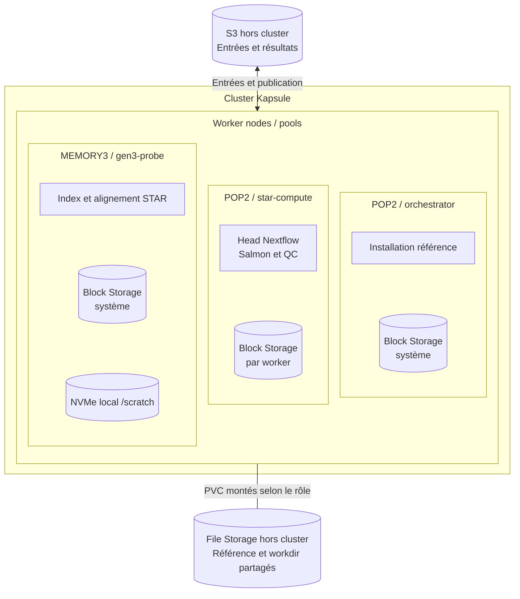

# RNA-seq sur Scaleway Kapsule

Terraform déploie Kapsule **1.37.0**, les pools et le stockage. Kubernetes lance Nextflow **25.10.4** avec nf-core/rnaseq **3.14.0**. Les commandes ci-dessous reproduisent le test de cette branche, puis permettent de remplacer le jeu public par vos données.

## Architecture



Le diagramme correspond au profil GEN3 du test. Avec `scaleway_kapsule` seul, STAR tourne aussi sur POP2.

### Stockage : rôle et moment d'utilisation

| Stockage | Où / données | Quand il intervient |
| --- | --- | --- |
| **Block Storage** | Disque système de chaque worker (20 Go) | Dès le démarrage du nœud : OS, images et runtime Kubernetes. Aucun PVC Block dédié au calcul. |
| **NVMe scratch** | Local au worker GEN3, exposé aux pods STAR via `/scratch` | Pendant l'indexation et l'alignement : fichiers temporaires. Les sorties déclarées reviennent sur SFS avant fin de tâche; le scratch ne sert pas à la reprise. |
| **File Storage — référence** | SFS 50 Go, monté sur plusieurs workers | Installation initiale de FASTA/GTF, contrôle avant le run, lecture par les tâches. L'orchestrator monte uniquement ce SFS. |
| **File Storage — workdir** | SFS 200 Go, partagé entre les workers de calcul | Pendant tout le run : sorties de tâches, index STAR, cache et session Nextflow. Relu lors d'une reprise; l'alignement lit encore l'index depuis SFS. |
| **S3 — données** | Buckets hors du cluster : FASTQ, samplesheet et résultats | Entrées au lancement et au staging; publication des BAM, quantifications et MultiQC après les tâches. Les résultats restent disponibles après retrait des workers. |
| **S3 — état Terraform** | Bucket séparé, hors du cluster | Pendant les commandes Terraform : état partagé et verrou. Sans rôle dans le calcul Nextflow. |

## Prérequis

- Un projet Scaleway dédié et un bucket privé/versionné pour le state, dans un **autre projet**.
- Une API key opérateur : `AllProductsFullAccess` sur le projet POC et `IAMApplicationManager` (ou `IAMManager`) pour l'identité Nextflow. Lecture du secret pipeline et accès au bucket d'état requis.
- Quotas disponibles : POP2-4C-16G et jusqu'à deux POP2-HM-8C-64G en `fr-par-3`, un MEMORY3-X8C-64G en `fr-par-2`, SFS 250 Go et disques système.
- Terraform ≥ 1.11, Scaleway CLI, kubectl, AWS CLI, jq, make, curl et gzip. Sur macOS :

```bash
brew install scw kubectl awscli jq make curl gzip
brew tap hashicorp/tap
brew install hashicorp/tap/terraform
scw login
```

## Déployer

```bash
cp terraform/infra/backend.hcl.example terraform/infra/backend.hcl
cp terraform/kubernetes/backend.hcl.example terraform/kubernetes/backend.hcl
cp terraform/infra/terraform.tfvars.example terraform/infra/terraform.tfvars
cp terraform/kubernetes/terraform.tfvars.example terraform/kubernetes/terraform.tfvars
```

Renseignez le même bucket d'état dans les deux `backend.hcl`; `scw_project_id` et `operator_user_id` dans les variables infra. Les exemples contiennent les types de nœuds, les limites d'autoscaling et les tailles SFS. Ces fichiers locaux et vos clés ne doivent pas être commités.

Un administrateur crée le bucket d'état une fois; chaque opérateur utilise ses propres identifiants autorisés sur ce bucket :

```bash
scw object bucket create NOM_BUCKET_ETAT enable-versioning=true acl=private project-id=UUID_PROJET_ETAT region=fr-par
export AWS_ACCESS_KEY_ID="CLE_ETAT"
export AWS_SECRET_ACCESS_KEY="SECRET_ETAT"
export KUBECONFIG="$HOME/.kube/config-hcl-public-netflow"
make plan
make deploy
```

`make deploy` applique Terraform infra, installe le kubeconfig, applique Terraform Kubernetes et synchronise le secret S3. Examinez les plans avant confirmation. [État partagé et exploitation](docs/OPERATIONS.md).

## Préparer le test

Installez GRCh38 Ensembl 110 sur SFS, puis attendez la fin du Job :

```bash
make reference
kubectl wait -n bioinformatics --for=condition=complete job/reference-bootstrap-ensembl-110 --timeout=6h
```

Le jeu public [ENA SRR1039508](https://www.ebi.ac.uk/ena/browser/view/SRR1039508) est réduit à **50 000 paires humaines de 63 bases**, `unstranded`. Téléchargez les premières paires et vérifiez le nombre de lignes :

```bash
for mate in 1 2; do
  curl -fsSL "https://ftp.sra.ebi.ac.uk/vol1/fastq/SRR103/008/SRR1039508/SRR1039508_${mate}.fastq.gz" \
    | gzip -dc | head -n 200000 | gzip -c > "SRR1039508_${mate}.fastq.gz"
  test "$(gzip -dc "SRR1039508_${mate}.fastq.gz" | wc -l)" -eq 200000
done
```

L'arrêt du téléchargement par `head` peut afficher une erreur de pipe fermé; le contrôle des 200 000 lignes vérifie le sous-jeu. Lancez ces commandes dans un shell sans `pipefail`.

Créez la samplesheet et versez les fichiers dans le bucket d'entrée. Le sous-shell utilise les clés pipeline; il conserve les clés du state dans le terminal principal :

```bash
INPUT_BUCKET=$(terraform -chdir=terraform/infra output -raw input_bucket_name)
RESULTS_BUCKET=$(terraform -chdir=terraform/infra output -raw results_bucket_name)
RUN_ID=poc-001
PREFIX=validation/$RUN_ID
printf 'sample,fastq_1,fastq_2,strandedness\nSRR1039508,s3://%s/%s/SRR1039508_1.fastq.gz,s3://%s/%s/SRR1039508_2.fastq.gz,unstranded\n' \
  "$INPUT_BUCKET" "$PREFIX" "$INPUT_BUCKET" "$PREFIX" > samplesheet.csv
SECRET_ID=$(terraform -chdir=terraform/infra output -raw pipeline_credentials_secret_id)
SECRET_ID=${SECRET_ID##*/}
REVISION=$(terraform -chdir=terraform/infra output -raw pipeline_credentials_revision)
(
  set -e
  SECRET=$(scw secret version access "$SECRET_ID" revision="$REVISION" region=fr-par raw=true)
  AWS_ACCESS_KEY_ID=$(jq -er '.access_key' <<<"$SECRET")
  AWS_SECRET_ACCESS_KEY=$(jq -er '.secret_key' <<<"$SECRET")
  export AWS_ACCESS_KEY_ID AWS_SECRET_ACCESS_KEY
  unset SECRET
  for file in SRR1039508_1.fastq.gz SRR1039508_2.fastq.gz samplesheet.csv; do
    aws --endpoint-url https://s3.fr-par.scw.cloud --region fr-par s3 cp "$file" "s3://$INPUT_BUCKET/$PREFIX/"
  done
)
```

## Lancer et suivre

```bash
cat > kubernetes/run/run.env <<EOF
RUN_ID=$RUN_ID
INPUT=s3://$INPUT_BUCKET/$PREFIX/samplesheet.csv
OUTDIR=s3://$RESULTS_BUCKET/runs/$RUN_ID
RUN_RESUME=0
NF_PROFILE=scaleway_kapsule,gen3_scratch_benchmark
AWS_DEFAULT_REGION=fr-par
EOF
make run
kubectl get job -n bioinformatics "nextflow-$RUN_ID"
kubectl logs -n bioinformatics -f "job/nextflow-$RUN_ID" -c nextflow
```

`make run` est un raccourci pour `kubectl apply -k kubernetes/run`. Le Job continue si le terminal est fermé; vous pouvez reprendre le suivi plus tard. Un nouvel essai utilise un nouveau `RUN_ID`. Les résultats sont sous `runs/$RUN_ID/`, dont `multiqc/star_salmon/multiqc_report.html`.

Pour des données synthétiques ou réelles, remplacez les FASTQ et la samplesheet (colonnes `sample,fastq_1,fastq_2,strandedness`). Le dépôt ne génère pas de données synthétiques. Déposez les entrées sous `validation/<run-id>/`, adaptez `run.env`, puis relancez. Les paramètres biologiques sont dans `kubernetes/base/params.yaml`; les ressources par tâche dans `kubernetes/base/nextflow.config`. Le seuil Salmon de la démonstration est abaissé pour le petit jeu : rétablissez le défaut nf-core pour des données réelles.

## Résultat du test de cette branche

Les tests locaux, les validations Terraform/Kubernetes et le run ont réussi. Les plans avec refresh et verrou S3 étaient sans changement sur un cluster existant : **un provisionnement neuf n'a pas été retesté**. Deux applications identiques ont conservé le même Job.

| Étape | Durée observée | Résultat | Pool |
| --- | --- | --- | --- |
| Contrôle de la référence existante | 12 s | Référence valide | orchestrator |
| Démarrage du head après création du Job | ~2 min | Init et Nextflow démarrés | star-compute |
| Génération de l'index STAR | 37 min 19 s de calcul; ~1 h 10 pour la tâche complète | Scratch vérifié, index recopié sur SFS | gen3-probe |
| Chargement et alignement STAR | 25 min 24 s, dont ~22 min 32 s de chargement | 94,06 % d'alignements uniques | gen3-probe |
| Quantification, QC et publication | ~14 min | Salmon, featureCounts et MultiQC disponibles | star-compute |
| Run complet | **2 h 03 min 56 s** | **45 tâches réussies**, retrait automatique du nœud GEN3 | pools calcul |

Un échantillon, deux FASTQ compressés de **5 226 949 octets**. Après filtrage : 49 539 paires; STAR : 46 597 alignements uniques; featureCounts : 43 428 fragments affectés; Salmon : 10 036 transcrits non nuls. BAM/index, quantifications, logs et MultiQC vérifiés dans S3 : 389 objets, environ 557 Mo.

**Estimation : ~2,7 € HT pendant le run** : orchestrator 0,46 €, POP2 calcul 1,27 €, GEN3 0,81 €, SFS 0,11 €, disques système ~0,02 €. Tarifs utilisés : 0,2205 / 0,618 / 0,4532 €/h pour ces nœuds, 0,000221 €/Go/h pour SFS et 0,000130 €/Go/h pour Block 5K. Sources : [Instances](https://www.scaleway.com/en/pricing/virtual-instances/) et [stockage](https://www.scaleway.com/en/pricing/storage/). Estimation hors arrondis de facturation, Object Storage, IPv4, Secret Manager et éventuel coût du scratch; les ressources restantes continuent à être facturées après le run.

Le test valide le parcours POC sur un petit jeu, sans fixer de seuil QC biologique ni qualifier la production. L'index d'alignement reste lu depuis SFS; le scratch ne supprime pas ce chargement. Reprise, état partagé et limites : [Exploitation](docs/OPERATIONS.md).
