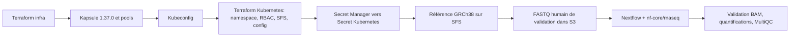

# nf-core/rnaseq sur Scaleway Kapsule

Déploiement reproductible d'un cluster Kubernetes managé Scaleway Kapsule en **Kubernetes 1.37.0**, de la plateforme Nextflow, puis validation d'un run RNA-seq humain `nf-core/rnaseq`. Terraform sépare l'infrastructure Scaleway des ressources Kubernetes. Les données d'entrée et résultats sont dans Object Storage; le workdir et la référence GRCh38 sont sur des volumes SFS RWX.

Le jeu humain fourni valide la chaîne logicielle sur un échantillon léger. Ce dépôt n'affirme pas une capacité de production pour des cohortes complètes : voir [la revue de préparation production](docs/PRODUCTION-READINESS.md).

## Parcours de déploiement



Le pipeline tourne dans un Job Nextflow de tête; son executor Kubernetes crée les pods de tâches dans le cluster. Le pool orchestrateur héberge la tête, le pool de calcul s'adapte aux tâches lourdes. Le bucket backend Terraform est indépendant des buckets d'entrée et de résultats et n'est pas détruit avec eux.

Les objets de données sont versionnés. Les versions courantes sont conservées indéfiniment; les versions remplacées sont expirées après 365 jours par défaut et les uploads multipart incomplets après 7 jours. Le backend active `use_lockfile=true`, supporté par Object Storage Scaleway depuis la prise en charge des écritures conditionnelles; voir le [guide backend Terraform Scaleway](https://registry.terraform.io/providers/scaleway/scaleway/latest/docs/guides/backend_guide).

## Prérequis

- Un projet Scaleway avec droits nécessaires à Kapsule, VPC, SFS, Object Storage et Secret Manager dans la région cible.
- Terraform **1.11+**, Scaleway CLI `scw`, `kubectl`, AWS CLI v2, `jq`, `curl`, `gzip`, `make` et Bash.
- Un profil AWS CLI configuré pour le backend, par exemple `AWS_PROFILE=state`, avec droits limités au bucket de state. L'API Scaleway CLI et l'identité AWS/S3 sont des credentials distincts.
- Un bucket Scaleway Object Storage dédié au state Terraform, créé avant le premier `terraform init`. Le backend S3 utilise `use_lockfile=true` pour les verrous natifs.
- Une configuration CLI Scaleway active (`scw init` ou profil configuré).

Variables d'environnement requises :

| Variable | Usage |
|---|---|
| `SCW_PROFILE` ou `SCW_ACCESS_KEY`, `SCW_SECRET_KEY` | Déployer Scaleway et lire la version de secret dans Secret Manager |
| `AWS_PROFILE=state` (recommandé) ou `AWS_ACCESS_KEY_ID`, `AWS_SECRET_ACCESS_KEY` | Créer/versionner le bucket et accéder au state Terraform |
| `PIPELINE_S3_ACCESS_KEY`, `PIPELINE_S3_SECRET_KEY` | Surcharge facultative des clés pipeline; sinon elles sont lues silencieusement depuis Secret Manager |

Les valeurs de projet et de région sont configurées dans les fichiers `terraform.tfvars` locaux, copiés depuis les exemples. `AWS_PROFILE=state` doit avoir les droits sur le seul bucket de state. Les clés applicatives S3 sont stockées dans Scaleway Secret Manager puis injectées dans Kubernetes par `make sync-secret`; les scripts de validation les lisent silencieusement depuis Secret Manager lorsqu'ils en ont besoin et les transmettent uniquement aux appels AWS CLI. Scaleway attribue les permissions Object Storage au niveau du projet; les bucket policies ne garantissent pas une isolation de cette identité aux seuls buckets du pipeline. Pour la production, utiliser un projet dédié.

## Préparer la configuration

1. Copier les exemples. Dans les deux `backend.hcl`, utiliser le même nom de bucket globalement unique; les clés `hcl-public-netflow/infra.tfstate` et `hcl-public-netflow/kubernetes.tfstate` restent distinctes. Renseigner aussi le projet et la région dans `terraform.tfvars` :

   ```bash
   cp terraform/infra/backend.hcl.example terraform/infra/backend.hcl
   cp terraform/kubernetes/backend.hcl.example terraform/kubernetes/backend.hcl
   cp terraform/infra/terraform.tfvars.example terraform/infra/terraform.tfvars
   cp terraform/kubernetes/terraform.tfvars.example terraform/kubernetes/terraform.tfvars
   ```

2. Configurer les profils `scw` et AWS; le profil `scw` doit cibler le même projet que `scw_project_id`, et `AWS_PROFILE=state` doit accéder au bucket de state. Créer le bucket privé et activer son versioning avant le premier `terraform init` :

   ```bash
   make bootstrap-state STATE_BUCKET=<nom-unique> STATE_REGION=fr-par
   ```

   La commande peut être relancée; elle conserve le versioning activé. Les identifiants backend passent par `AWS_PROFILE` ou `AWS_*`; ils ne vont pas dans `backend.hcl`.

Les credentials, les fichiers `backend.hcl`, les `.tfvars`, le state et les kubeconfigs sont exclus de Git. Les valeurs sensibles peuvent rester présentes dans le state provider Scaleway; protéger le backend comme un secret.

## Déployer puis valider le run humain

Choisir un identifiant stable et propre au run. La commande complète déploie les deux couches Terraform, installe le kubeconfig, synchronise le secret, prépare GRCh38, charge le dataset de validation et vérifie les sorties :

```bash
make deploy-and-validate STATE_BUCKET=<nom-unique> RUN_ID=validation-20260925
```

Terraform présente les plans et demande confirmation avant chaque apply. Pour une exécution non interactive après revue des plans :

```bash
AUTO_APPROVE=1 make deploy-and-validate STATE_BUCKET=<nom-unique> RUN_ID=validation-20260925
```

Étapes individuelles pour contrôler le déploiement :

```bash
make init STATE_BUCKET=<nom-unique>
make infra-plan
make infra-apply
make kubeconfig
make platform-plan
make platform-apply
make sync-secret
make status
make bootstrap-reference
make prepare-demo RUN_ID=validation-20260925
make run-pipeline RUN_ID=validation-20260925
make validate-run RUN_ID=validation-20260925
```

Les scripts `prepare-demo.sh` et `validate-run.sh` utilisent l'AWS CLI localement avec `PIPELINE_S3_*` pour accéder à Object Storage. Ne pas inscrire ces clés dans un fichier versionné ni les passer comme arguments. Le Job Nextflow consomme le Secret Kubernetes `pipeline-s3-credentials`.

Les sorties sont sous `s3://<bucket-résultats>/runs/<RUN_ID>/`. La validation vérifie notamment que le Job est terminé, que les fichiers de comptage/quantification et le BAM de STAR ne sont pas vides, et que MultiQC est présent. Elle constitue un contrôle technique du run; l'interprétation des résultats reste bioinformatique.

`make smoke-test RUN_ID=<id>` prépare la référence GRCh38 et le petit dataset humain, lance le pipeline et vérifie les artefacts. `make deploy-and-validate` ajoute le déploiement des composants. Les ré-exécutions avec le même identifiant ciblent les mêmes entrées et sorties; la reprise Nextflow est opt-in :

```bash
make run-pipeline RUN_ID=validation-20260925 RESUME=1
# ou, pour relancer le parcours smoke complet sans recharger les FASTQ :
make smoke-test RUN_ID=validation-20260925 RESUME=1
```

N'utiliser la reprise qu'après avoir confirmé l'intégrité du workdir et des résultats intermédiaires.

## Commandes courantes

| Commande | Action |
|---|---|
| `make help` | Afficher les cibles |
| `make bootstrap-state STATE_BUCKET=<nom>` | Créer le bucket privé de state et activer le versioning |
| `make init STATE_BUCKET=<nom>` | Bootstrapper le bucket, puis initialiser les deux states distants |
| `make infra-plan` / `make infra-apply` | Planifier/appliquer l'infrastructure Scaleway |
| `make kubeconfig` | Installer le kubeconfig dans `~/.kube/config-hcl-public-netflow` |
| `make platform-plan` / `make platform-apply` | Planifier/appliquer namespace, RBAC, SFS et configuration |
| `make cluster STATE_BUCKET=<nom>` | Exécuter les phases dans le bon ordre jusqu'au secret Kubernetes |
| `make bootstrap-reference` | Installer la référence GRCh38 et son manifest sur SFS |
| `make prepare-demo RUN_ID=<id>` | Préparer les FASTQ humains et la samplesheet |
| `make run-pipeline RUN_ID=<id>` | Lancer `nf-core/rnaseq` et conserver le BAM requis pour la validation |
| `make validate-run RUN_ID=<id>` | Contrôler les sorties d'un run |
| `make status` | Afficher nœuds, PVC, Jobs et pods |
| `make fmt`, `make validate`, `make shell-syntax` | Vérifications locales Terraform et scripts |
| `make destroy` | Détruire les ressources (interactif; lire les plans) |

Les détails sur la reprise, le diagnostic et la conservation des données sont dans [docs/OPERATIONS.md](docs/OPERATIONS.md).

## État de validation et limites

Le dépôt automatise les contrôles de syntaxe Terraform et Bash en CI. Un succès CI ne provisionne pas Scaleway et ne démontre pas un run génomique; le déploiement et le run nécessitent des credentials, un quota et une exécution dans le compte cible. N'annoncer la capacité production qu'après avoir suivi la [checklist production](docs/PRODUCTION-READINESS.md), incluant un run représentatif de la charge réelle, un test de reprise et une restauration.

**Blocage IAM actuel pour le run S3 :** la clé pipeline ne possède actuellement que `ObjectStorageBucketsRead`; cela ne suffit pas aux lectures/écritures d'objets FASTQ et résultats. Les bucket policies Terraform ne remplacent pas ces droits IAM. L'infrastructure et la plateforme peuvent être déployées, mais `make smoke-test` s'arrêtera lors des opérations S3 tant qu'une identité avec les droits objet requis n'est pas autorisée. Comme ces permissions sont attribuées au niveau du projet Scaleway, utiliser de préférence un projet dédié avant d'élargir l'accès.

Pour un run représentatif en taille, tenir compte de la mémoire de STAR sur GRCh38, de la capacité/débit SFS, des quotas Scaleway et du coût de l'autoscaling. Les profils par défaut sont destinés au pilote.
