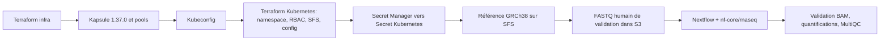

# nf-core/rnaseq sur Scaleway Kapsule

Déploiement reproductible d'un cluster Kubernetes managé Scaleway Kapsule en **Kubernetes 1.37.0**, de la plateforme Nextflow, puis validation d'un run RNA-seq humain `nf-core/rnaseq`. Terraform sépare l'infrastructure Scaleway des ressources Kubernetes. Les données d'entrée et résultats sont dans Object Storage; le workdir et la référence GRCh38 sont sur des volumes SFS RWX.

Le jeu humain fourni valide la chaîne logicielle sur un échantillon léger. Ce dépôt n'affirme pas une capacité de production pour des cohortes complètes : voir [la revue de préparation production](docs/PRODUCTION-READINESS.md).

| Composant | Version |
|---|---|
| Kubernetes Kapsule | 1.37.0 |
| Nextflow | 25.10.4 |
| nf-core/rnaseq | 3.14.0 |
| Plugin Nextflow Kubernetes (`nf-k8s`) | 1.2.2 |
| Plugin Nextflow S3 (`nf-amazon`) | 3.4.1 |
| Référence | GRCh38, Ensembl release 110 |

Les versions des plugins sont fixées pour correspondre à Nextflow 25.10.4; la mise à niveau vers `nf-k8s` 1.4+ requiert Nextflow 25.12 ou ultérieur.

## Parcours de déploiement



Le pipeline tourne dans un Job Nextflow de tête; son executor Kubernetes crée les pods de tâches dans le cluster. Le pool orchestrateur héberge la tête, le pool de calcul s'adapte aux tâches lourdes. Le bucket backend Terraform est indépendant des buckets d'entrée et de résultats et n'est pas détruit avec eux.

Les objets de données sont versionnés. Les versions courantes sont conservées indéfiniment; les versions remplacées sont expirées après 365 jours par défaut et les uploads multipart incomplets après 7 jours. Le backend active `use_lockfile=true`, supporté par Object Storage Scaleway depuis la prise en charge des écritures conditionnelles; voir le [guide backend Terraform Scaleway](https://registry.terraform.io/providers/scaleway/scaleway/latest/docs/guides/backend_guide).

## Prérequis

- Le projet Scaleway dédié `hcl-nextflow` (`1d6906b8-42b0-4141-8752-28b7fcfccb95`) dans l'organisation SA-Demo, avec les droits nécessaires à Kapsule, VPC, SFS, Object Storage et Secret Manager.
- La configuration pilote cible la région `fr-par`, zone `fr-par-3` (à confirmer selon la disponibilité et les quotas au moment du déploiement).
- Terraform **1.11+**, Scaleway CLI `scw`, `kubectl`, AWS CLI v2, `jq`, `curl`, `gzip`, `make` et Bash.
- Une clé S3 backend dédiée, chargée depuis Scaleway Secret Manager comme décrit à l'étape de préparation. L'API Scaleway CLI et l'identité AWS/S3 sont des credentials distincts.
- Un bucket Scaleway Object Storage dédié au state Terraform, créé avant le premier `terraform init`. Le backend S3 utilise `use_lockfile=true` pour les verrous natifs.
- Une configuration CLI Scaleway active (`scw init` ou profil configuré).

Variables d'environnement :

| Variable | Usage |
|---|---|
| `SCW_PROFILE` ou `SCW_ACCESS_KEY`, `SCW_SECRET_KEY` | Déployer Scaleway et lire la version de secret dans Secret Manager |
| `AWS_PROFILE` ou `AWS_ACCESS_KEY_ID`, `AWS_SECRET_ACCESS_KEY` | Accéder au bucket de state Terraform avec une identité backend dédiée |
| `PIPELINE_S3_ACCESS_KEY`, `PIPELINE_S3_SECRET_KEY` | Surcharge facultative des clés pipeline pour les opérations S3 locales; sinon elles sont lues silencieusement depuis Secret Manager |

L'exemple `terraform/infra/terraform.tfvars.example` pointe vers le projet dédié `hcl-nextflow`; les paramètres non secrets restent dans les fichiers locaux copiés depuis les exemples. `STATE_PROJECT_ID` pointe explicitement le bootstrap du bucket backend sur ce même projet, même si le profil `scw` actif a un autre projet par défaut. L'identité du profil Scaleway doit toutefois avoir accès à `hcl-nextflow`. Les clés applicatives S3 sont stockées dans Scaleway Secret Manager puis injectées dans Kubernetes par `make sync-secret`; les scripts de validation les lisent silencieusement depuis Secret Manager lorsqu'ils en ont besoin et les transmettent uniquement aux appels AWS CLI. Scaleway accorde les permissions Object Storage IAM au niveau projet : les identités pipeline et backend ont donc accès aux objets de toutes les buckets de `hcl-nextflow` selon leurs permission sets. Le projet dédié évite de mêler ces droits aux buckets d'autres projets.

## Préparer la configuration

1. Copier les exemples. Dans les deux `backend.hcl`, utiliser le même nom de bucket globalement unique; les clés `hcl-public-netflow/infra.tfstate` et `hcl-public-netflow/kubernetes.tfstate` restent distinctes. Renseigner aussi le projet et la région dans `terraform.tfvars` :

   ```bash
   cp terraform/infra/backend.hcl.example terraform/infra/backend.hcl
   cp terraform/kubernetes/backend.hcl.example terraform/kubernetes/backend.hcl
   cp terraform/infra/terraform.tfvars.example terraform/infra/terraform.tfvars
   cp terraform/kubernetes/terraform.tfvars.example terraform/kubernetes/terraform.tfvars
   ```

2. Configurer le profil `scw` avec accès au projet `hcl-nextflow`. Remplacer `REPLACE_WITH_PRECREATED_STATE_BUCKET` dans les deux `backend.hcl` par le nom choisi pour le bucket state. Charger les identifiants S3 backend depuis le Secret Manager de l'environnement en utilisant l'identifiant de secret, révision et région fournis par l'opérateur. Exemple dans le shell courant, sans affichage ni fichier local :

   ```bash
   : "${STATE_SECRET_ID:?Set the Secret Manager ID for the backend key}"
   : "${STATE_SECRET_REVISION:?Set the backend key revision}"
   : "${STATE_REGION:?Set the Scaleway region for that secret}"
   : "${STATE_PROJECT_ID:?Set the Scaleway project UUID for the backend bucket}"
   set +x
   state_credentials="$(scw secret version access "$STATE_SECRET_ID" revision="$STATE_SECRET_REVISION" region="$STATE_REGION" raw=true)"
   export AWS_ACCESS_KEY_ID="$(jq -er '.access_key' <<<"$state_credentials")"
   export AWS_SECRET_ACCESS_KEY="$(jq -er '.secret_key' <<<"$state_credentials")"
   unset state_credentials
   export STATE_BUCKET="replace-with-unique-bucket-name"
   make bootstrap-state STATE_BUCKET="$STATE_BUCKET" STATE_PROJECT_ID="$STATE_PROJECT_ID" STATE_REGION="$STATE_REGION"
   ```

   Cette clé doit être distincte des identifiants API `SCW_PROFILE`. Ne pas copier les credentials dans `terraform.tfvars`, `backend.hcl`, un fichier versionné ou les logs CI. La commande de bootstrap passe `STATE_PROJECT_ID` explicitement à `scw` et vérifie le versioning; elle peut être relancée sans effet destructeur.

   Les droits de la clé backend incluent `ObjectStorageBucketsRead`, `ObjectStorageObjectsRead`, `ObjectStorageObjectsWrite` et `ObjectStorageObjectsDelete`, notamment pour le verrou `.tflock`. Les permissions IAM Scaleway sont au niveau projet et couvrent donc toutes les buckets de ce projet; l'isoler aux ressources de la solution.

Les credentials, les fichiers `backend.hcl`, les `.tfvars`, le state et les kubeconfigs sont exclus de Git. Les valeurs sensibles peuvent rester présentes dans le state provider Scaleway; protéger le backend comme un secret.

## Déployer puis valider le run humain

Choisir un identifiant stable et propre au run. La commande complète déploie les deux couches Terraform, installe le kubeconfig, synchronise le secret, prépare GRCh38, charge le dataset de validation et vérifie les sorties :

```bash
make deploy-and-validate STATE_BUCKET="$STATE_BUCKET" RUN_ID=validation-20260925
```

Terraform présente les plans et demande confirmation avant chaque apply. Pour une exécution non interactive après revue des plans :

```bash
AUTO_APPROVE=1 make deploy-and-validate STATE_BUCKET="$STATE_BUCKET" RUN_ID=validation-20260925
```

Étapes individuelles pour contrôler le déploiement :

```bash
make init STATE_BUCKET="$STATE_BUCKET"
make infra-plan
make infra-apply
make kubeconfig
make platform-plan
make platform-apply
make sync-secret
make status
make bootstrap-reference
make prepare-demo RUN_ID=validation-20260925
make run-pipeline RUN_ID=validation-20260925
make validate-run RUN_ID=validation-20260925
```

Les scripts qui accèdent localement à Object Storage résolvent les clés de l'application depuis Scaleway Secret Manager; ils ne les affichent pas et les injectent seulement dans l'environnement du sous-processus AWS CLI. Une surcharge locale `PIPELINE_S3_*` est possible, mais n'est pas nécessaire au parcours standard. Le Job Nextflow consomme le Secret Kubernetes `pipeline-s3-credentials`. La bucket policy autorise la lecture du bucket d'entrée et le dépôt des données de démonstration uniquement sous `validation/*`; sur le bucket résultats, elle autorise les lectures et écritures nécessaires au pipeline.

Les sorties sont sous `s3://<bucket-résultats>/runs/<RUN_ID>/`. La validation vérifie notamment que le Job est terminé, que les fichiers de comptage/quantification et le BAM de STAR ne sont pas vides, et que MultiQC est présent. Elle constitue un contrôle technique du run; l'interprétation des résultats reste bioinformatique.

`make smoke-test RUN_ID=<id>` prépare la référence GRCh38 et le petit dataset humain, lance le pipeline et vérifie les artefacts. `make deploy-and-validate` ajoute le déploiement des composants. Les ré-exécutions avec le même identifiant ciblent les mêmes entrées et sorties; la reprise Nextflow est opt-in :

```bash
make run-pipeline RUN_ID=validation-20260925 RESUME=1
# ou, pour relancer le parcours smoke complet sans recharger les FASTQ :
make smoke-test RUN_ID=validation-20260925 RESUME=1
```

N'utiliser la reprise qu'après avoir confirmé l'intégrité du workdir et des résultats intermédiaires.

## Commandes courantes

| Commande | Action |
|---|---|
| `make help` | Afficher les cibles |
| `make bootstrap-state STATE_BUCKET=<nom> [STATE_PROJECT_ID=<uuid>]` | Créer le bucket privé de state et activer le versioning dans le projet dédié |
| `make init STATE_BUCKET=<nom>` | Bootstrapper le bucket dans le projet dédié, puis initialiser les deux states distants |
| `make infra-plan` / `make infra-apply` | Planifier/appliquer l'infrastructure Scaleway |
| `make kubeconfig` | Installer le kubeconfig dans `~/.kube/config-hcl-public-netflow` |
| `make platform-plan` / `make platform-apply` | Planifier/appliquer namespace, RBAC, SFS et configuration |
| `make cluster STATE_BUCKET=<nom>` | Exécuter les phases dans le bon ordre jusqu'au secret Kubernetes |
| `make bootstrap-reference` | Installer la référence GRCh38 et son manifest sur SFS |
| `make prepare-demo RUN_ID=<id>` | Préparer les FASTQ humains et la samplesheet |
| `make run-pipeline RUN_ID=<id>` | Lancer `nf-core/rnaseq` et conserver le BAM requis pour la validation |
| `make validate-run RUN_ID=<id>` | Contrôler les sorties d'un run |
| `make status` | Afficher nœuds, PVC, Jobs et pods |
| `make fmt`, `make validate`, `make shell-syntax` | Vérifications locales Terraform et scripts |
| `make destroy` | Détruire les ressources (interactif; lire les plans) |

Les détails sur la reprise, le diagnostic et la conservation des données sont dans [docs/OPERATIONS.md](docs/OPERATIONS.md).

## État de validation et limites

Le dépôt automatise les contrôles de syntaxe Terraform et Bash en CI. Un succès CI ne provisionne pas Scaleway et ne démontre pas un run génomique; le déploiement et le run nécessitent des credentials, un quota et une exécution dans le compte cible. N'annoncer la capacité production qu'après avoir suivi la [checklist production](docs/PRODUCTION-READINESS.md), incluant un run représentatif de la charge réelle, un test de reprise et une restauration.

Les permissions IAM Object Storage `ObjectStorageObjectsRead` et `ObjectStorageObjectsWrite` sont configurées pour l'identité du pipeline dans le projet dédié `hcl-nextflow`. Les bucket policies limitent davantage les usages attendus : lecture de l'entrée, écriture d'entrées de validation sous `validation/*`, et lecture/écriture des résultats. Scaleway attribue les permissions IAM objet à l'échelle du projet; garder ce projet dédié aux ressources de ce déploiement. Le run de bout en bout n'est pas déclaré validé tant qu'il n'a pas été exécuté et que ses artefacts n'ont pas passé les contrôles ci-dessus.

Pour un run représentatif en taille, tenir compte de la mémoire de STAR sur GRCh38, de la capacité/débit SFS, des quotas Scaleway et du coût de l'autoscaling. Les profils par défaut sont destinés au pilote.
